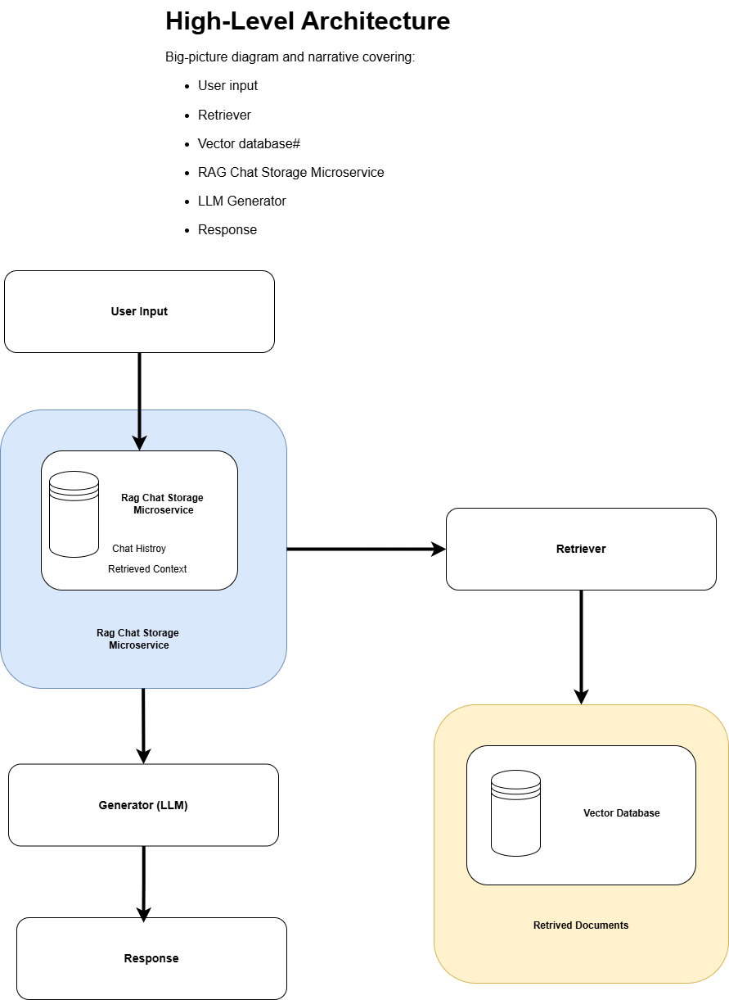
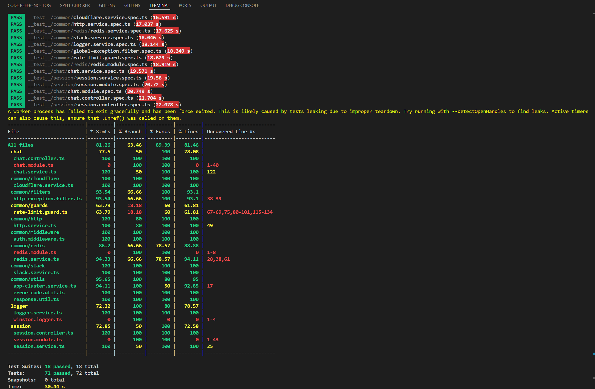

# RAG Chat Storage Microservice

A production-ready NestJS microservice that stores and manages **chat sessions** and **messages** from a Retrieval-Augmented Generation (RAG) system. It includes APIs to manage sessions, store assistant and user messages with context, and ensures scalability, security, and observability.

---

## What is RAG (Retrieval-Augmented Generation)?

**Retrieval-Augmented Generation (RAG)** enhances language models by combining external knowledge (retrieved documents) with the user prompt to improve accuracy and factual grounding.

**Flow:**

1. **User Input**
2. **Retriever** queries a **Vector DB** for relevant content
3. **RAG Storage Service** logs user prompt, response, and retrieved context
4. **Generator (LLM)** creates final response
5. **Storage** persists messages and sessions.

This service fits into step 3 — storing **chat history and associated retrieval context**.

---

## High-Level Architecture



---

## Internal Microservice Architecture

This service supports:

- Storing session-specific messages
- Adding/retrieving message context
- Basic session management (rename, favorite, delete)


Built with NestJS following:

- Modular structure
- RESTful APIs
- Middleware (Auth, Rate Limiting)
- Global Exception Handling & Logging
- MongoDB for persistence

---

## Features

✅ Create, rename, favorite, and delete chat sessions  
✅ Store user/assistant messages with optional RAG context  
✅ Retrieve full or paginated message history  
✅ API Key authentication  
✅ Rate limiting  
✅ Health check endpoints  
✅ Centralized logging  
✅ Dockerized setup  
✅ Swagger API documentation

---

## Tech Stack

| Layer            | Tech                             |
| ---------------- | -------------------------------- |
| Framework        | NestJS                           |
| Language         | TypeScript                       |
| Database         | MongoDB                          |
| Containerization | Docker, Docker Compose           |
| Auth             | API Key middleware               |
| Rate Limiting    | Redis-based                      |
| Monitoring       | Custom Logger + Exception Filter |

---

## Project Structure

```
src/
├── chat/
│ ├── dto/
│ ├── schemas/
│ ├── chat.controller.ts
│ ├── chat.service.ts
│ └── chat.module.ts
├── common/
│ ├── middleware/
│ ├── guards/
│ ├── filters/
│ ├── logger/
│ ├── cloudflare/, redis/, utils/
├── config/
├── health/
main.ts
```

---

## Setup Instructions

### 1. Clone the Repo

```bash
git clone https://github.com/venkhatbalaji/rag-chat-system
cd rag-chat-storage
```

### 2. Environment Setup

```bash
cp .env.example .env
```

Update values in \`.env\`

### 3. Run with Docker

```bash
docker-compose up --build
```

### 4. Run Locally (Without Docker)

```bash
npm install
npm run start:dev
```

---

## Available APIs

| Method | Endpoint                              | Description                               |
| ------ | ------------------------------------- | ----------------------------------------- |
| GET    | `/api/v1/health`                      | Health check endpoint                     |
| GET    | `/api/v1/sessions`                    | List all sessions                         |
| POST   | `/api/v1/sessions`                    | Create new session                        |
| DELETE | `/api/v1/sessions/:id`                | Delete a session and its messages         |
| PATCH  | `/api/v1/sessions/:id`                | Rename or mark/unmark session as favorite |
| GET    | `/api/v1/sessions/:sessionId/message` | Retrieve messages in a session            |
| POST   | `/api/v1/sessions/:sessionId/message` | Add a message to a session                |
| GET    | `/docs`                               | Swagger UI (auto-generated docs)          |

## All APIs require the `x-api-key` header.

## Swagger/OpenAPI Integration

Swagger has been integrated using `@nestjs/swagger`. Access the interactive API docs at:

```
http://localhost:3000/api-docs
```

Example config in `main.ts`:

```ts
import { SwaggerModule, DocumentBuilder } from '@nestjs/swagger';

const swaggerConfig = new DocumentBuilder()
  .setTitle(`${appName}.api`)
  .setDescription(`${appName}.api Documentation`)
  .setVersion('1.0')
  .addApiKey({ type: 'apiKey', name: 'x-api-key', in: 'header' }, 'API_KEY')
  .build();
const document = SwaggerModule.createDocument(app, swaggerConfig);
SwaggerModule.setup('docs', app, document);
```

---

## Test Coverage



---

## Bonus Features (Implemented)

- ✅ Dockerized MongoDB
- ✅ Healthcheck endpoints (`/health`)
- ✅ Centralized Winston logger
- ✅ Global error handler
- ✅ Swagger documentation
- ✅ Basic test folder structure included

---

## License

MIT
